# Asterisk

# What is asterisk? 🤔

_Asterisk is a **free software** program (under **GPL** license) that provides functionalities of a telephone exchange (**PBX**). Like any PBX, a specific number of phones can be connected to make calls to each other within the same organization and even access communications outside the same to the **PSTN (Public switched telephone network)** or by connecting to a **VoIP** provider or to an **ISDN (Integrated Services Digital Network)** both basic and primary._

# What is VoIP? ☎

_VoIP is **Voice Over Internet Protocol**. It is used to make calls using the **TCP/IP** stack. With Asterisk VoIP server, you can make calls to and from your **Android phone** and other **IP phones** locally without **any cost**. This is very **cost effective solution** for small, medium to large **corporate offices.**_


# Basic steps 📖

In this article, I will show you how to install and configure Asterisk to act as a VoIP server and makes call to and from Android phone using your own Asterisk VoIP server. I will be using Lubuntu 18.04 LTS for the demonstration. Note that, Lubuntu 18.04 LTS is the same as Ubuntu 18.04 LTS but with LXDE desktop instead of GNOME 3 desktop. Let’s get started.

⚠**NOTE:** _You can look at the version of your operating system enter the terminal `(Control + Alt + T)` and enter the following command:_

```
lsb_release -a
```
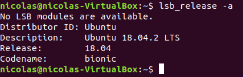

### 1. Update the machine and restart it: 📋

In the terminal, enter the following command:
```
sudo apt update
```
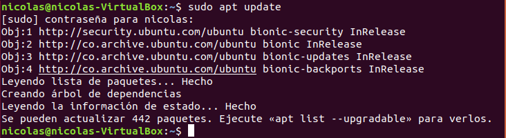

⚠**NOTE:** _The APT package repository cache should be updated._

### 2. Now install Asterisk VoIP server with the following command: 📋

In the terminal, enter the following command:

```
sudo apt install asterisk asterisk-dahdi
```

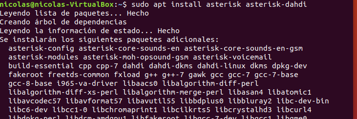

⚠**NOTE:** _Asterisk should be installed._

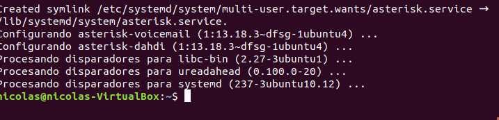

### 3. Starting and Stopping Asterisk Service:. 📋

Now you can check whether the asterisk service is running with the following command::

```
sudo systemctl status asterisk
```

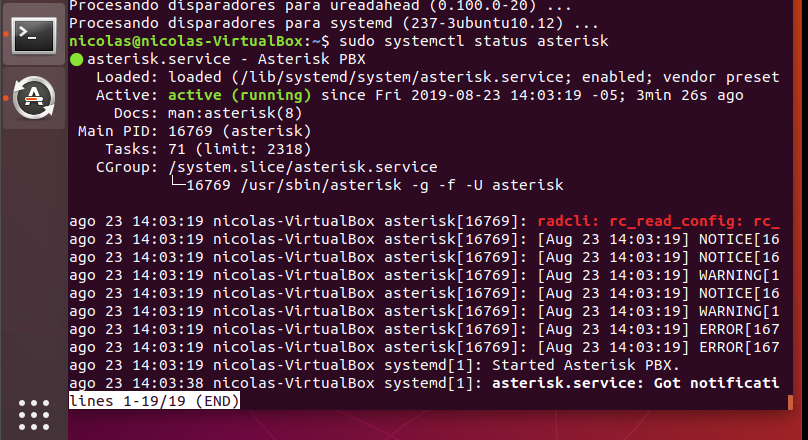

⚠**NOTE:** _If in any case, the asterisk service is not running, you can start the asterisk service with the following command:_

```
sudo systemctl start asterisk
```

⚠**NOTE:** _If you want to stop the asterisk service for some reason, then run the following command:_

```
sudo systemctl stop asterisk
```

⚠**NOTE:** _If you have changed the asterisk configuration files, then you can restart asterisk for the changes to take effect with the following command:_

```
sudo systemctl restart asterisk
```

### 4. Configuration Files of Asterisk VoIP Server: 📋
On Ubuntu 18.04 LTS, the Asterisk configuration files are in **/etc/asterisk** directory as you can see in the screenshot below.

```
ls /etc/asterisk
```
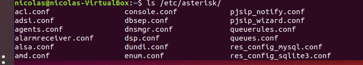

➡ _Configuring Asterisk as a VoIP server and make calls using a SIP client on Android phones. For this to work, I will only modify the sip.conf and extensions.conf configuration files in the /etc/asterisk directory._

### 5. Configuring Asterisk as a VoIP Server: 📋
First, navigate to the /etc/asterisk directory with the following command:

```
cd /etc/asterisk
```
Now you should make a backup copy of the sip.conf and extensions.conf file. Because, if you’ve made any major mistakes and you want to revert back to the default sip.conf and extensions.conf file, you will be able to do it if you have a backup copy of these configuration files. You won’t have to re-install Asterisk.
To make a backup copy of sip.conf file, run the following command:

```
sudo cp sip.conf sip.conf.backup
```


➡ _To make a backup copy of extensions.conf file, run the following command:_
```
sudo cp extensions.conf extensions.conf.backup
```
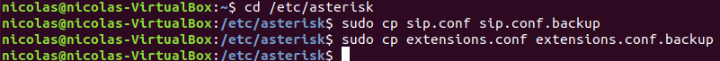

➡ _Now run the following command to remove all the existing lines from the sip.conf file:_
```
echo | sudo tee sip.conf
```
➡ _Now run the following command to open sip.conf file with nano text editor:_
```
sudo nano sip.conf
```
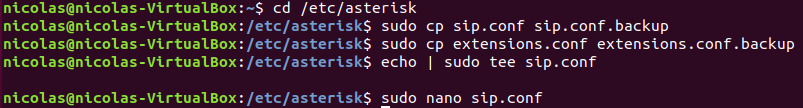

➡ _And add the following lines to sip.conf file and save the file._
```

```
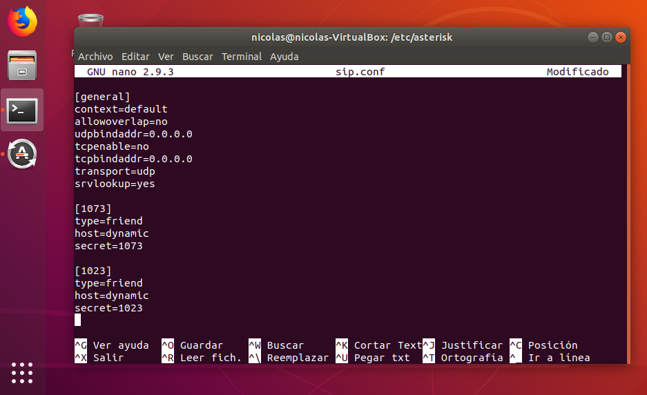

➡ _Here, I created 2 users 1073 and 1023. Their password is set using secret. The password for the user 1073 is 1073, and for the user 1023 is 1023._

➡ _Now run the following command to remove all the existing lines from the extensions.conf file:_

```
echo | sudo tee extensions.conf
```
➡ _Then, run the following command to open extensions.conf file with nano text editor:_

```
sudo nano extensions.conf
```
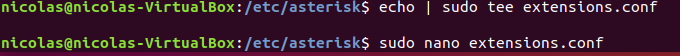

➡ _Now add the following lines to extensions.conf file and save the file._
```

```
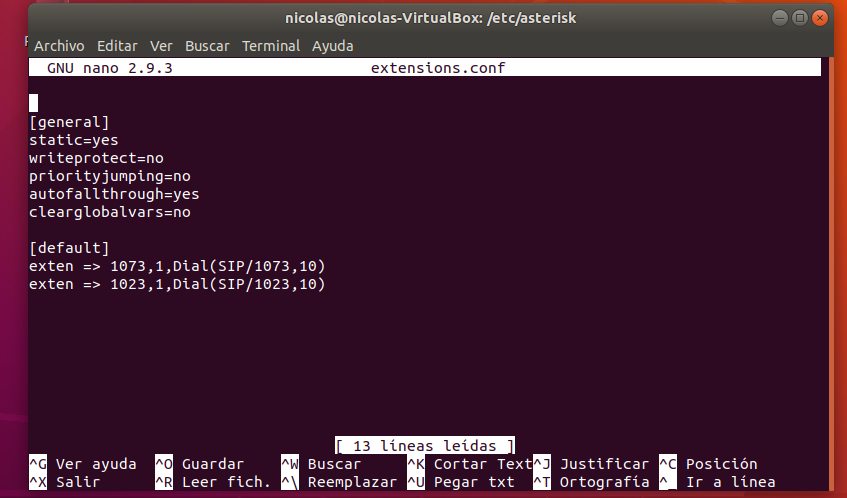

➡ _Once you’re done with all the steps above, restart asterisk with the following command:_

```
sudo systemctl restart asterisk
```
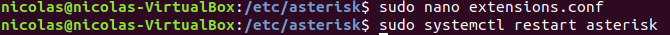

➡ _Now check whether the asterisk service is running with the following command:_

```
sudo systemctl status asterisk
```
➡ _As you can see, it is running. So our configuration is working._
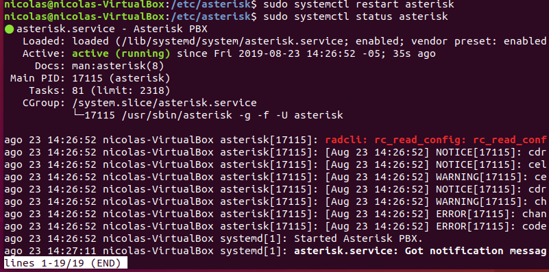

➡ _Now run the following command to check the IP address of your Asterisk VoIP server:_

```
ip a
```
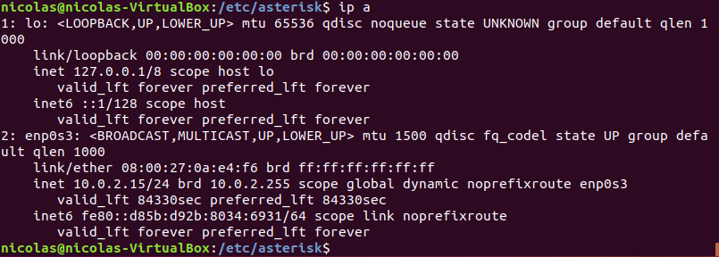

_As you can see, the IP address of my Asterisk server is **10.0.2.15/24**. Take a note of this IP address as you will need it when you will connect to your Asterisk server from your Android phone._

### 6. Connecting to Asterisk VoIP Server from Android:📋

On Android, there are many free SIP clients available in the Google Play Store that you can download and connect to your own Asterisk VoIP server. The one I like is called **MizuDroid**. It is a very simple and easy to use SIP client on Android. You can make calls and send text messages using [MizuDroid](https://play.google.com/store/apps/details?id=com.mizuvoip.mizudroid.app&hl=es_CO).


--------------------------------------------------------------------------------------------

## Author ✒️

* **Nico Patalagua** - *Repository* - [Github](https://github.com/NicoPatalagua)

## If you liked this repostory 🎁
* Share it 📢
* Invite me a beer 🍺  
* Improve it 🤓.

---
## By 📌
[NicoPatalagua](https://www.instagram.com/nicopatalagua/) 😎
